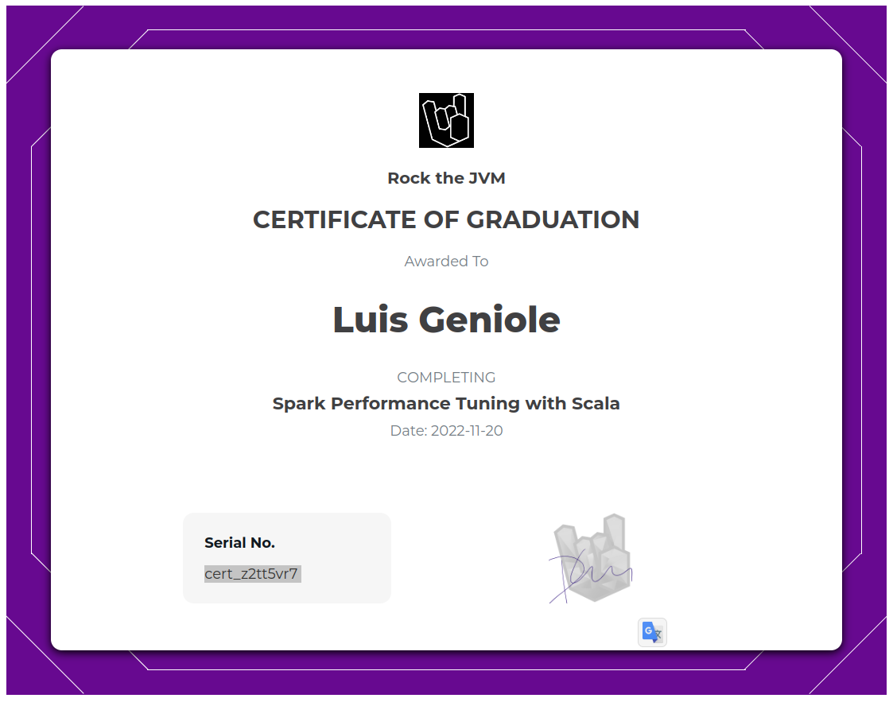

# Rock The JVM - Spark Optimizations with Scala

Master Spark optimization techniques with Scala.

- https://rockthejvm.com/p/spark-performance-tuning
- https://github.com/rockthejvm/spark-performance-tuning
- https://github.com/rockthejvm/spark-performance-tuning/releases/tag/start

## Certificate



> I'm the operator with my cluster calculator

## Sections

1. [Scala and Spark Recap](src/main/scala/section1)
2. [Foundations](src/main/scala/section2)
3. [Memory, Caching and Checkpointing](src/main/scala/section3)
4. [Partitioning](src/main/scala/section4)
5. [Performance Tuning](src/main/scala/section5)

## Setup

### IntelliJ IDEA

Install IntelliJ IDEA with the Scala plugin.

- https://www.jetbrains.com/idea/

### Docker

Install Docker:

- https://docs.docker.com/desktop/install/ubuntu/
- https://docs.docker.com/engine/install/ubuntu/#set-up-the-repository

Build images:

```bash
$ cd spark-cluster
$ chmod +x build-images.sh
$ ./build-images.sh
```

Start dockerized Spark cluster:

```bash
$ docker compose up --scale spark-worker=3
```

Access containers:

```bash
# List active containers
$ docker ps
# Get a shell in any container
$ docker exec -it CONTAINER_NAME bash
```
